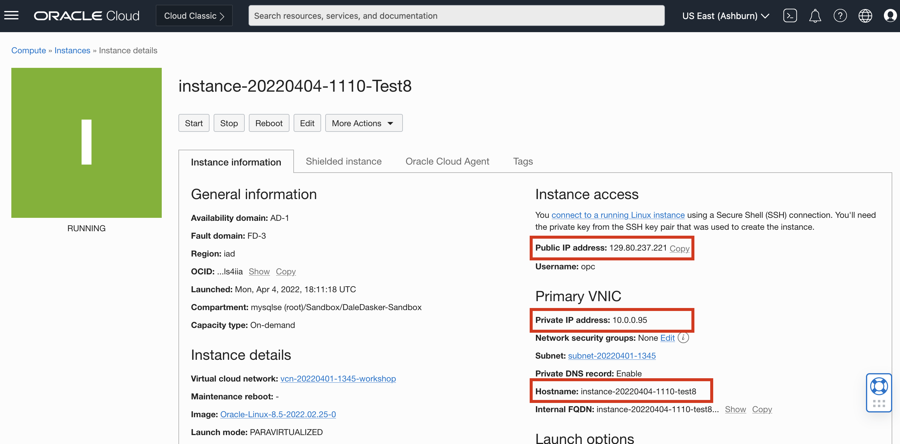
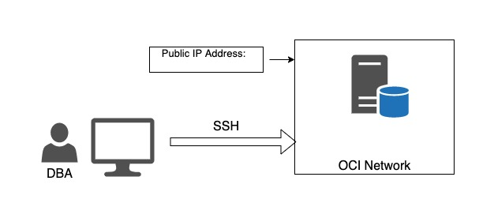

# SETUP

## Environment Setup

Objective: Connect Personal Computer to the Oracle Network and the Oracle Cloud Infrastructure (OCI)

In this lab you will Download lab materials, plus connect your Personal Computer to the Oracle Network and the Oracle Cloud Infrastructure (OCI)

Estimated Lab Time: -- 10 minutes

### Objectives
In this lab, you will:
* Download lab materials
* Setup SSH client
* Record Server information

### Prerequisites

*In compliance with Oracle security policies, I acknowledge I will not load actual confidential customer data or Personally Identifiable Information (PII) into my demo environment*

This lab assumes you have:
* An Oracle account
* All previous labs successfully completed

## Task 1: Download Lab Material and SSH client
1. * [presentation](files/MySQL_HA_11022023.pdf)
   * [WorkshopInstructions](files/CompleteWorkshop.pdf)
2. SSH keys to connect labs (it’s the same key in two different formats).  These keys should have been created when you were creating your Compute Instance.  
    * id_rsa in native openssl format. Use it with Workbench
    * id_rsa.ppk in putty format for windows. Use it only with putty
3. If you have not yet installed an SSH client on your laptop, please install one
    e.g. (windows) https://www.putty.org/

## Task 2: Record Lab Server info on Notepad

**student###-Server:**
  - Hostname:  
  - Hostname FQDN:  
  - Public IP:   (e.g. 130.61.56.195) 
  - Private IP: (e.g. 10.0.11.18)

 **Example:**

 

## Task 3: Review Misc Lab Information
1. Document standard 
    - When in the manual you read **shell>** the command must be executed in the Operating System shell.
    - When in the manual you read **mysql>** the command must be executed in a client like MySQL, MySQL Shell, MySQL Workbench, etc. We recommend students to use MySQL Shell to practice with it.
    - When in the manual you read MySQL **mysqlsh>** the command must be executed in MySQL Shell.

2. Lab standard  
    -  shell> the command must be executed in the Operating System shell
    -  mysql> the command must be executed in a client like MySQL, MySQL Workbench
    -  mysqlsh> the command must be executed in MySQL shell

3.	The software used for the labs is located on a local /workshop folder within each server.

4.	Tip: set the keep alive for SSH connection to 60 seconds, to keep session open during lectures

5.	Linux ***opc*** user has limited privileges. To work with administrative privileges, use "sudo" like 
 shell> sudo su - root

## Task 4: Setup Lab Server and Connection

1.	Server description
    **ServerA** will be used to run the full Workshop on.  You will:
    - Install MySQL Enterprise Edition 8.0.
    - Install a MySQL Shell as a command line interface for MySQL Enterprise Edition.
    - Install the Sample Employees Database

2.	Sever Connections example:



3.	Test the connection to your Linux machines from your laptop using these parameters
    - a. SSH connection
    - b. SSH key file named “id_rsa” or " 
    - c. username “opc”
    - d. no password
    - e. Public IP address of your assigned Linux VM (serverA, serverB)


4. Examples of connections: 

  *Linux:* use “id_rsa” key file

  ** shell>**
    ```
    <copy>ssh -i id_rsa opc@public_ip </copy>
    ```


## Task 5: Setup workshop directory on Server


1. SSH to Server 

    ** shell>**
    ```
    <copy>ssh -i id_rsa opc@public_ip </copy>
    ```

2.  Make /workshop Directory

    ** shell>**
    ```
    <copy>mkdir workshop 
    cd workshop</copy>

    ```

3.  Wget workshop files 

    ** For the Ashburn Region shell>**
    ```
    <copy>wget https://objectstorage.us-ashburn-1.oraclecloud.com/p/PpCWxUSEe80OKB7HU14XlfMZrbC7pbTSE9uGSmQ3pjk1ief1mhEqT0TM92Ira3vF/n/idazzjlcjqzj/b/bucket-20220901-1608-workshop_RPM/o/workshop32.zip</copy>
    ```
    
4.  Extract workshop files 

    ** shell>**
    ```
    <copy>unzip  workshop32.zip </copy>
    ```


## Learn More

* [Creating SSH Keys](https://docs.oracle.com/en-us/iaas/Content/Compute/Tasks/managingkeypairs.htm)
* [Compute SSH Connections](https://docs.oracle.com/en-us/iaas/Content/Compute/Tasks/accessinginstance.htm)

## Acknowledgements
* **Author** - Dale Dasker, MySQL Solution Engineering
* **Last Updated By/Date** - <Dale Dasker, April 2023
